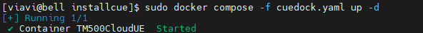
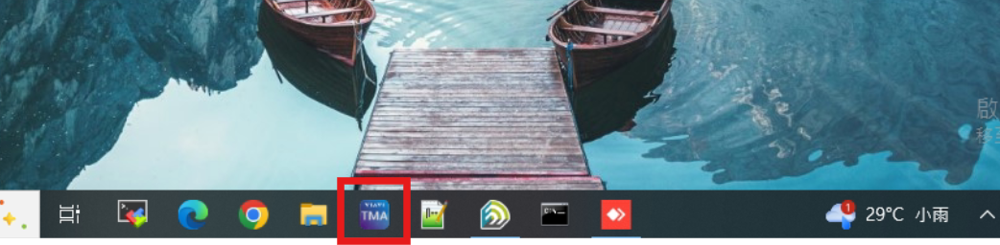

# Access Method
TM500 Server (Supermicro) :

* IP Address : 192.168.8.67
* Username : viavi
* Password : viavi

TM500 Control PC :

* IP Address : 192.168.8.68
* User Password : bmwee809
* Anydesk ID : 1549083559
* Anydesk Password : bmwbmwbmwee809

FlexRAN+xFAPI+OSC O-DU HIGH+OAI CU(Supermicro) :

* IP Address : 192.168.8.76
    * Username : ubuntu
    * Password : bmwlab
    * Root Password : bmwlab
* IDRAC IP : 192.168.10.87
    * IDRAC user name : ADMIN
    * IDRAC Password : WDLZISCGYS
# Run Application

* Enviroment ( on control PC ) 
1. MobaXterm
2. BMWLab's VPN (`.conf`) & Wireguard
## 1. TM500 Status
### Step 1.1 Configure TM500
For this integration, we're using a [CSV file](https://github.com/bmw-ece-ntust/sheryl-e2e-integrations/blob/7e9067064f0b8ad226df4e8fe7e09c8172f84c5f/TM500%20%2B%20FlexRAN%20%2B%20xFAPI%20%2B%20O-DU%20HIGH%20%2B%20OAI%20CU/1.%20TM500%2BFlexRAN%2Btestmac/Intel%20TM500%20RU%20and%20UE%20configs/TM500%20RU%20and%20UE%20configs/oran_2_0_defaults.csv) provided by Intel. To better identify it, we've changed the filename to [4x4_9000_testmac.csv](https://github.com/bmw-ece-ntust/sheryl-e2e-integrations/blob/master/TM500%20%2B%20FlexRAN%20%2B%20xFAPI%20%2B%20O-DU%20HIGH%20%2B%20OAI%20CU/1.%20TM500%2BFlexRAN%2Btestmac/NTUST%20TM500%20RU%20and%20UE%20configs/4x4_9000_testmac.csv).

### Step 1.2 Bring up TM500(cloudUE)
* In Control PC , open [MobaXterm](https://github.com/shuchu11/TM500/blob/2e0fed78f98bddb5f059ae3cf924e998c1bb657c/mobaXterm/installation.md)  and use SSH to access TM500 server ( 192.168.8.67 ) .


* Fill in FTP_USER and ETH0_ADDR in `cuedock.yaml`.
```
cd installcue/
vim cuedock.yaml
FTP_ADDR = 192.168.8.68 // control PC IP   這一行TM500現為192.168.8.71 需和Sheryl討論需不需要改
ETH0_ADDR = 192.168.8.67 // cloudUE ETH0 IP
```

> [!NOTE]
> How to edit in vim :\
> editing mode `i ` \
> leave and dont save : `esc` + `:q! `
> save and leave :  `esc` + `:wq `

* start docker and run up cloudUE
```
# start docker
sudo systemctl start docker

# Install cloudUE on docker:
cd installcue/
sudo docker compose -f cuedock.yaml up -d
```


* check cloudUE container is running up properly

```
sudo docker ps
```

The status is `Up` , it's sucessful .

Then you can telnet (you can find the icon `telnet` by clicking the icon `session` on the left-left of window ) \
to TM500(192.168.8.67) to see the log.


> [!NOTE]
> If you get crash dump you can try to restart docker.
```
# Remove cloudUE from docker:
sudo docker compose -f cuedock.yaml down
```
>After remove you need to bring up cloudue again
```
sudo docker compose -f cuedock.yaml up -d
```

* Make licience up
```
sudo docker ps
sudo docker exec -it  <container id> /bin/bash
rm -rf sda1
exit
```
### Step1.3 TM500 PTP Synchronization
> Check in control PC telnet window

* PTP in TM500 will sync automatically. If you see the log below it sync successfully.

**less of pic , i need t0 link to TM500**

### Step1.4 Use TMA to control TM500

#### Connection with TM500

**Wait until you see this log stop in ==telnet== window, you can use TMA to connect TM500.**

**( Host : OAI7.2_750 )** 
* Click TMA icon in  PC if you cant find it check `C:\Program Files (x86)\VIAVI\TM500\5G NR - NLC 1.4.0\Test Mobile Application/TMA`




# 2. Run TM500
## Step2.1 Set csv files
Put two configuration(`o-ran.cfg` and `4x4_9000_testmac.csv`) under the path `C:\Users\bmwlab\Desktop\viavi cloudue\NLA_7_4_0\TM500_NR_5G_EXT-MUE_Release_NLA_7_4_0_CloudUE\ppc_pq\public\ftp_root`


> [!NOTE]
> If you edit 4x4_9000_testmac.csv. Remember to reboot TM500.
## (Opt)New Session
* click the top part main menu "Session" > "New Session"


* or use window controls + w
    * can check using session time in "Current Session" next to bottom part "Command Line"
    * right click in Command Line window > Clear can clean up the log
    * If you don't need to catch measurement log then don't need to do this step.

## Step2.2 Connect TM500
Press top-left corner green key to connect TM500.


```
source /home/oai72/Script/oaiTMvf.sh

cd /home/oai72/FH_7.2_dev/openairinterface5g/cmake_targets/ran_build/build

sudo ./nr-softmodem -O ../../../targets/PROJECTS/GENERIC-NR-5GC/CONF/gnb.sa.band78.273prb.fhi72.2x2-TM500_johnson.conf --sa --reorder-thread-disable 1 --thread-pool 1,3,5,7,9,11,13,15 > /home/oai72/Johnson/log/0427.log
```

In TM500 command:
```
FORW MTE GETRUSTATS
```
Make sure there is no too much early and late packet

