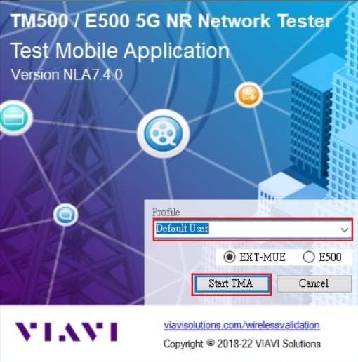

# Access Method
TM500 Server (Supermicro) :

* IP Address : 192.168.8.67
* Username : viavi
* Password : viavi

TM500 Control PC :

* IP Address : 192.168.8.68
* User Password : bmwee809
* Anydesk ID : 1549083559
* Anydesk Password : bmwbmwbmwee809

FlexRAN+xFAPI+OSC O-DU HIGH+OAI CU(Supermicro) :

* IP Address : 192.168.8.76
    * Username : ubuntu
    * Password : bmwlab
    * Root Password : bmwlab
* IDRAC IP : 192.168.10.87
    * IDRAC user name : ADMIN
    * IDRAC Password : WDLZISCGYS
# Run Application

* Enviroment ( on control PC ) 
1. MobaXterm
2. BMWLab's VPN (`.conf`) & Wireguard
## 1. TM500 Status
### Step 1.1 Configure TM500
For this integration, we're using a [CSV file](https://github.com/bmw-ece-ntust/sheryl-e2e-integrations/blob/7e9067064f0b8ad226df4e8fe7e09c8172f84c5f/TM500%20%2B%20FlexRAN%20%2B%20xFAPI%20%2B%20O-DU%20HIGH%20%2B%20OAI%20CU/1.%20TM500%2BFlexRAN%2Btestmac/Intel%20TM500%20RU%20and%20UE%20configs/TM500%20RU%20and%20UE%20configs/oran_2_0_defaults.csv) provided by Intel. To better identify it, we've changed the filename to [4x4_9000_testmac.csv](https://github.com/bmw-ece-ntust/sheryl-e2e-integrations/blob/master/TM500%20%2B%20FlexRAN%20%2B%20xFAPI%20%2B%20O-DU%20HIGH%20%2B%20OAI%20CU/1.%20TM500%2BFlexRAN%2Btestmac/NTUST%20TM500%20RU%20and%20UE%20configs/4x4_9000_testmac.csv).

### Step 1.2 Bring up TM500(cloudUE)
* In Control PC , open [MobaXterm](https://github.com/shuchu11/TM500/blob/2e0fed78f98bddb5f059ae3cf924e998c1bb657c/mobaXterm/installation.md)  and use SSH to access TM500 server ( 192.168.8.67 ) .


* Fill in FTP_USER and ETH0_ADDR in `cuedock.yaml`.
```
cd installcue/
vim cuedock.yaml
FTP_ADDR = 192.168.8.68 // control PC IP   這一行TM500現為192.168.8.71 需和Sheryl討論需不需要改
ETH0_ADDR = 192.168.8.67 // cloudUE ETH0 IP
```

> [!NOTE]
> How to edit in vim :\
> editing mode `i ` \
> leave and dont save : `esc` + `:q! `
> save and leave :  `esc` + `:wq `

* start docker and run up cloudUE
```
# start docker
sudo systemctl start docker

# Install cloudUE on docker:
cd installcue/
sudo docker compose -f cuedock.yaml up -d
```


* check cloudUE container is running up properly

```
sudo docker ps
```

The status is `Up` , it's sucessful .

Then you can telnet (you can find the icon `telnet` by clicking the icon `session` on the left-left of window ) \
to TM500(192.168.8.67) to see the log.


> [!NOTE]
> If you get crash dump you can try to restart docker.
```
# Remove cloudUE from docker:
sudo docker compose -f cuedock.yaml down
```
>After remove you need to bring up cloudue again
```
sudo docker compose -f cuedock.yaml up -d
```

* Make licience up
```
sudo docker ps
sudo docker exec -it  <container id> /bin/bash
rm -rf sda1
exit
```
### Step1.3 TM500 PTP Synchronization
> Check in control PC telnet window

* PTP in TM500 will sync automatically. If you see the log below it sync successfully.

**less of pic , i need t0 link to TM500**

### Step1.4 Use TMA to control TM500

#### Connection with TM500

**Wait until you see this log stop in ==telnet== window, you can use TMA to connect TM500.**

**( Host : OAI7.2_750 )** 
* Click TMA icon in  PC if you cant find it check `C:\Program Files (x86)\VIAVI\TM500\5G NR - NLC 1.4.0\Test Mobile Application/TMA`





## 2. Run TM500
### Step2.1 Set csv files
Put two configuration(`o-ran.cfg` and `4x4_9000_testmac.csv`) under the path `C:\Users\bmwlab\Desktop\viavi cloudue\NLA_7_4_0\TM500_NR_5G_EXT-MUE_Release_NLA_7_4_0_CloudUE\ppc_pq\public\ftp_root`


> [!NOTE]  
> If you edit 4x4_9000_testmac.csv. Remember to reboot TM500.

### (Opt)New Session
- click the top part main menu "Session" > "New Session"

<br>


<br>

- or use window controls + w 

	- can check using session time in "Current Session" next to bottom part "Command  Line"
	- right click in Command Line window > Clear can clean up the log
	- If you don't need to catch measurement log then don't need to do this step.

### Step2.2 Connect TM500
Press top-left corner green key to connect TM500.


### Step2.3 TM500 Connect Preference
#### Configuration Set to "No Configuration"
"Connection" > "Configuration" > "Configuration" > **"No Configuration"**


<br>

Due to [ORAN - ORU Setting RUName Setting Issue](https://github.com/bmw-ece-ntust/sheryl-e2e-integrations/blob/master/TM500%20%2B%20FlexRAN%20%2B%20xFAPI%20%2B%20O-DU%20HIGH%20%2B%20OAI%20CU/1.%20TM500%2BFlexRAN%2Btestmac/Troubleshoot%20of%20TM500%2BFlexRAN%2Btestmac.md#tm500-runame-settin). We need to use "No Configuration" and manually command the setting. If want to use 2x2, can use MTS Mode and skip step "[4.2 Command the following in TM500](https://github.com/bmw-ece-ntust/sheryl-e2e-integrations/blob/master/TM500%20%2B%20FlexRAN%20%2B%20xFAPI%20%2B%20O-DU%20HIGH%20%2B%20OAI%20CU/1.%20TM500%2BFlexRAN%2Btestmac/Integration%20Guide%20of%20TM500%2BFlexRAN%20L1%2Btestmac.md#42-command-the-following-in-tm500)" to "[4.4 set eth2 to 9000](https://github.com/bmw-ece-ntust/sheryl-e2e-integrations/blob/master/TM500%20%2B%20FlexRAN%20%2B%20xFAPI%20%2B%20O-DU%20HIGH%20%2B%20OAI%20CU/1.%20TM500%2BFlexRAN%2Btestmac/Integration%20Guide%20of%20TM500%2BFlexRAN%20L1%2Btestmac.md#44-set-eth2-to-9000)".

#### TCP/IP Address Set to TM500 Server(192.168.8.67)
"Connection" > "Setup" > "Test Mobile TCP/IP Setting" > "IP Address" > **"192.168.8.67"**


#### Radio Card Setting
- "Connection" > "Radio Card" > "Radio Card Settings" > "I/F Mode" > **"ORAN"**
- If it is FH mode. Will run RUSIM.

<br>


- If your want to use 4x4 then need to click "Selected" of two radio cards , 2x2 click one

<br>


- Select `SubCarrier Spacing` and `Radio Bandwidth` for radio card based on your [configuration](#configuration)
- in this integration `SubCarrier Spacing` = **30kHz**, `Radio Bandwidth` = 100 **MHZ**

<br>


#### Press bottom-right OK


### Step2.3 Manually Set Configuration with Command
#### Wait the logs "Waiting for User to Configure Test Mobile" and "GSTS 0x00 Ok Reset" show

<br>


#### Command the following in TM500:
```
MULT STANDALONE
CONF ORU
SCXT 0 NR
SELR 0 FES-0 ORU1-P1 0 ORAN ORU4x4
ADDR 0 FES-0 ORU1-P1
CFGR 0 SCS 1
CONF ORU ORU4x4 DuMacAddress 00:11:22:33:44:66
CONF ORU ORU4x4 SysrepoInitFile 4x4_9000_testmac.csv
CONF ORU ORU4x4 MtuOverride 9000
CONF ORU ORU4x4
GETR
GSTS
LGPC
SCFG MTS_MODE
```
#### Wait the log "CU PLANE ACTIVE" shows
will takes some times

<br>


<br>

Command the following in TM500:
```
STRT
```
This will makes TM500 freeze for a little while

<br>


<br>

Command the following in TM500:
```
GSTS
GVER
```

## (Opt) Measurement log
### Logging Controller
This window will only show content and allow interaction after the TM500 has finished connecting
- For each log, there are two options: "log" or "view".
	- When "log" is selected, the related log information will be recorded in a file.
	- When "view" is selected, the related log information will be displayed in the TMA interface.
- Default only has Protocol logs


### Start Logging
Click the red dot around top-left


### Stop Logging
Click the red square beside the red dot. You can stop log collecting at any time when the E2E process ends or when enough of the necessary logs have been gathered.

### Convert Data
1. Click the `Convert Saved Data` in the toolbar at the top.


2. Click Convert


The progress will show under `Convert Saved Data` icon or by logs in `Command Line`


Finished converted files are located at `C:\Users\bmwlab\Documents\VIAVI\TM500\5G NR\Test Mobile Application\Logged Data\YYMMDD_HHMMSS_session\YYMMDD_HHMMSS`


## 3. Bring up gNB
<!-- TOC --><a name="step-31-configure-gnb"></a>
### Step 3.1 Configure gNB

### Step 3.2 gNB PTP synchronization
#### method 1. Run in System
If PTP is already configured as a system service, use the following commands to check its status.
```bash=
sudo journalctl -u ptp4l -f
sudo journalctl -u phc2sys -f
```
ptp4l rms < 100 and phc2sys phc offset < 100 represent sync
- ptp4l 

<br>


<br>

- phc2sys

<br>


<br>

guide of ptp run in system see [here](https://hackmd.io/@Spinnefarn/SJFvKX8ma#12-Time-Syncronization-PTP)

##### Troubleshott: phc2sys.service failed

This shows phc2sys.service active failed, use the below command to restart phc2sys.service
```
systemctl start phc2sys.service 
```
Keep checking phc2sys status until phc offset < 100. This may takes time.
#### method 2. Manually
```bash=
// Ternimal 1 - Run ptp4l
sudo ptp4l -i ens1f1 -m -H -2 -s -f /etc/ptp4l.conf

// wait ptp4l rms < 100 and create a new terminal window

// Ternimal 2 - Run phc2sys
sudo phc2sys -w -m -s ens1f1 -R 8 -f /etc/ptp4l.conf
```
ptp4l rms < 100 and phc2sys phc offset < 100 represent sync
- ptp4l

<br>


<br>

- phc2sys

<br>


<br>


### Step 3.3 Run gNB
> [!TIP]
> Following commands only need to do once each time run the server.
> 1. Set HW Accelerator to DPDK
> ```bash
> cd 
> sudo ./ini.sh
> ```
> 2. Set the virtual function to DPDK
>```bash
> # Create VF and bind VF with DPDK
> cd ~/intel_sw/phy
> sudo su
> ./cvl.sh
> exit
> ```
> See the content of `cvl.sh` [here](https://github.com/bmw-ece-ntust/sheryl-e2e-integrations/blob/master/TM500%20%2B%20FlexRAN%20%2B%20xFAPI%20%2B%20O-DU%20HIGH%20%2B%20OAI%20CU/cvl.sh)
> 
> 3. set realtime
> ```bash
> sudo tuned-adm profile realtime
> ```

To capture the console log, use MobaXterm instead of VS Code. After FlexRAN and testmac have stopped running, click "Terminal" in the top-left corner, then select "Save terminal text." While FlexRAN and testmac can automatically generate log files such as 'phy_tracelog_wls0.txt' and 'testmac_tracelog_wls0.txt', these files don't contain the complete logs.

#### 1. FlexRAN
```bash=
sudo su
cd /home/ubuntu/intel_sw/FlexRAN/l1/bin/nr5g/gnb/l1/
source ../../../../../../phy/setupenv.sh 
./l1.sh -xran
```
**Wait belows logs show:**
```
'''
L1 start tick is 1420814686800159
step  1 end tick[1420817993294819], used time[2363.470215(ms)]
step  2 end tick[1420822824888853], used time[3453.605225(ms)]
step  3 end tick[1420827714811245], used time[3495.298096(ms)]
total elapsed time [9312.373000(ms)]

PHY>welcome to application console
```


> [!CAUTION]
> Please make sure the above screen appears in the terminal before proceeding to the next step, to avoid potential issues with the server.


#### 2. testmac
Open another terminal window

In this integration, we use [testcase 600](https://github.com/bmw-ece-ntust/sheryl-e2e-integrations/tree/master/TM500%20%2B%20FlexRAN%20%2B%20xFAPI%20%2B%20O-DU%20HIGH%20%2B%20OAI%20CU/1.%20TM500%2BFlexRAN%2Btestmac/NTUST%20FlexRAN%20and%20Testmac%20configs/600)

The file [sprsp_mcc_mu1_100mhz_4x4_hton.cfg](https://github.com/shuchu11/TM500-FlexRAN-Testmac-NOTE/blob/7fb607460cfd8e2fd717feccc9d9125c22cce8ef/TM500%20%2B%20FlexRAN%20%2B%20Testmac/sprsp_mcc_mu1_100mhz_4x4_hton.cfg)" at `/home/ubuntu/intel_sw/FlexRAN/l1/bin/nr5g/gnb/testmac`, you can use the command below:
```
sudo su
cd /home/ubuntu/intel_sw/FlexRAN/l1/bin/nr5g/gnb/testmac
source ../../../../../../phy/setupenv.sh 
./l2.sh --testfile=sprsp_mcc_mu1_100mhz_4x4_hton.cfg
```

> [!CAUTION]
> The correct method to shut down L1 and L2.
> Enter `Ctrl + C ` in teatmac's (L2) treminal window and Flexran (L1) will automatically shutdown
> If you only open L1 ,you only need to enter `exit ` in L1's terminal window.

## 4. Interoperability between DU and RU
### Step 4.1 Check DU connection at RU side
In TM500 command:
```
FORW MTE GETRUSTATS
```
Make sure there is no too much early and late packet 

<br>


### Step 4.2 Check RU connection at DU side

- The packet count in FlexRan log should increase.

## [Opt]Catch PCAP in TM500

### using dpdk_cap()

1. Telnet to the FH Server port 23

2. command dpdk_cap(`<index>`, `<cap_size_in_mb>`) and CTRL + ENTER in telnet command line

- Format : dpdk_cap(`<index>`, `<cap_size_in_mb>`)

	- `<index>` is the eth port eth2=0, eth3=1

	- `<cap_size_in_mb>` is the total size to capture

	- example : dpdk_cap(0,1000), captures 1000MB files from eth2

#### 3. Log will save in folder

- path : `\VIAVI\TM500\5G NR - NLC 1.4.0\ppc_pq\public\ftp_root\`


## 5. Run UESIM
### 5.1 Init
"Test Manager" > "My Tests" > "testmac" > "Init" > "Run"

<br>


<br>

Make sure click the script "Init" > "Intel version Initial"

### (Opt) Capture MUX Log
"Test Manager" > "My Tests" > "testmac" > "MUX_LOG" > "Run"

<br>


<br>

Make sure click the scripts "MUX_LOG" > "OFF" and one of MUX Log script under "MUX_LOG"

- "MUX_LOG" > "SIB1 PDSCH CRC Failure"
```
#$$SET_DEBUG_LOG_PREFERENCES 0 [] [3{DBG_1 3(ladd hlc all  0 0 0 0 0 0 0 0 0 0 0 0 0 0 0 0 0 0 0 0 0 0x00000060 0 0x00006400 0 0 0 0 0 0 0 0 0 0 0 0 0 0 0 0 0 0 0 0 0 0 0 0 0 0 0 0 0 0 0 0 0 0 0 0 0 0 0x03E00000 0x00103020 0 0 0x00000E1E 0 0 0 0 0 0 0 0 0x00000020 0 0 0 0 0 0 0 0 0 0 0 0 0 0 0 0 0 0 0 0 0 0 0 0 0 0 0 0 0 0 0 0 0 0 0 0 0 0 0 0 0 0 0 0 0 0 0 0 0 0 0 0 0 0 0 0 0 0 0 0 0 0 0 0 0 0 0 0 0 0 0 0 0 0 0 0 0 0 0 0 0 0 0 0 0 0 0 0 0 0 0 0 0 0 0 0 0 0 0 0 0 0 0 0 0 0 0 0 0 0 0 0 0 0 0 0 0 0 0 0 0 0 0 0 0 0 0 0 0 0 0 0 0 0 0 0 0 0 0 0 0 0 0 0 0 0 0 0 0 0 0 0 0 0 0 0 0 0 0 0 0 0 0 0 0 0 0 0 0 0 0 0 0 0 0 0 0 0 0 0),DBG_2 3(ladd dbg_2 hlc all  0 0 0 0 0 0 0 0 0 0 0 0 0 0 0 0 0 0 0 0 0 0x00000060 0 0x00006400 0 0 0 0 0 0 0 0 0 0 0 0 0 0 0 0 0 0 0 0 0 0 0 0 0 0 0 0 0 0 0 0 0 0 0 0 0 0 0x03E00000 0x00103020 0 0 0x00000E1E 0 0 0 0 0 0 0 0 0x00000020 0 0 0 0 0 0 0 0 0 0 0 0 0 0 0 0 0 0 0 0 0 0 0 0 0 0 0 0 0 0 0 0 0 0 0 0 0 0 0 0 0 0 0 0 0 0 0 0 0 0 0 0 0 0 0 0 0 0 0 0 0 0 0 0 0 0 0 0 0 0 0 0 0 0 0 0 0 0 0 0 0 0 0 0 0 0 0 0 0 0 0 0 0 0 0 0 0 0 0 0 0 0 0 0 0 0 0 0 0 0 0 0 0 0 0 0 0 0 0 0 0 0 0 0 0 0 0 0 0 0 0 0 0 0 0 0 0 0 0 0 0 0 0 0 0 0 0 0 0 0 0 0 0 0 0 0 0 0 0 0 0 0 0 0 0 0 0 0 0 0 0 0 0 0 0 0 0 0 0 0),DBG_3 3(ladd dbg_2 hlc all  0 0 0 0 0 0 0 0 0 0 0 0 0 0 0 0 0 0 0 0 0 0x00000060 0 0x00006400 0 0 0 0 0 0 0 0 0 0 0 0 0 0 0 0 0 0 0 0 0 0 0 0 0 0 0 0 0 0 0 0 0 0 0 0 0 0 0x03E00000 0x00103020 0 0 0x00000E1E 0 0 0 0 0 0 0 0 0x00000020 0 0 0 0 0 0 0 0 0 0 0 0 0 0 0 0 0 0 0 0 0 0 0 0 0 0 0 0 0 0 0 0 0 0 0 0 0 0 0 0 0 0 0 0 0 0 0 0 0 0 0 0 0 0 0 0 0 0 0 0 0 0 0 0 0 0 0 0 0 0 0 0 0 0 0 0 0 0 0 0 0 0 0 0 0 0 0 0 0 0 0 0 0 0 0 0 0 0 0 0 0 0 0 0 0 0 0 0 0 0 0 0 0 0 0 0 0 0 0 0 0 0 0 0 0 0 0 0 0 0 0 0 0 0 0 0 0 0 0 0 0 0 0 0 0 0 0 0 0 0 0 0 0 0 0 0 0 0 0 0 0 0 0 0 0 0 0 0 0 0 0 0 0 0 0 0 0 0 0 0)}]
#$$START_DEBUG_LOGGING
```

- "MUX_LOG" > "SIB1 PDSCH CRC Failure"
```
#$$SET_DEBUG_LOG_PREFERENCES 0 [] [3{DBG_2 3(lcfg dbg_2 hlc all  0 0 0 0 0 0 0 0 0 0 0 0 0 0 0 0 0 0 0 0 0 0 0 0 0 0 0 0 0 0 0 0 0 0 0 0 0 0 0 0 0 0 0 0 0 0 0 0 0 0 0 0 0 0 0 0 0 0 0 0 0 0 0 0x00050020 0 0 0x00000E1E 0 0 0 0 0 0 0 0 0x00004020 0 0 0 0 0 0 0 0 0 0 0 0 0 0 0 0 0 0 0 0 0 0 0 0 0 0 0 0 0 0 0 0 0 0 0 0 0 0 0 0 0 0 0 0 0 0 0 0 0 0 0 0 0 0 0 0 0 0 0 0 0 0 0 0 0 0 0 0 0 0 0 0 0 0 0 0 0 0 0 0 0 0 0 0 0 0 0 0 0 0 0 0 0 0 0 0 0 0 0 0 0 0 0 0 0 0 0 0 0 0 0 0 0 0 0 0 0 0 0 0 0 0 0 0 0 0 0 0 0 0 0 0 0 0 0 0 0 0 0 0 0 0 0 0 0 0 0 0 0 0 0 0 0 0 0 0 0 0 0 0 0 0 0 0 0 0 0 0 0 0 0 0 0 0 0 0 0 0 0 0),DBG_3 3(lcfg dbg_3 hlc all  0 0 0 0 0 0 0 0 0 0 0 0 0 0 0 0 0 0 0 0 0 0 0 0 0 0 0 0 0 0 0 0 0 0 0 0 0 0 0 0 0 0 0 0 0 0 0 0 0 0 0 0 0 0 0 0 0 0 0 0 0 0 0x00A00000 0x00003004 0 0 0 0 0 0 0 0 0 0 0 0 0 0 0 0 0 0 0 0 0 0 0 0 0 0 0 0 0 0 0 0 0 0 0 0 0 0 0 0 0 0 0 0 0 0 0 0 0 0 0 0 0 0 0 0 0 0 0 0 0 0 0 0 0 0 0 0 0 0 0 0 0 0 0 0 0 0 0 0 0 0 0 0 0 0 0 0 0 0 0 0 0 0 0 0 0 0 0 0 0 0 0 0 0 0 0 0 0 0 0 0 0 0 0 0 0 0 0 0 0 0 0 0 0 0 0 0 0 0 0 0 0 0 0 0 0 0 0 0 0 0 0 0 0 0 0 0 0 0 0 0 0 0 0 0 0 0 0 0 0 0 0 0 0 0 0 0 0 0 0 0 0 0 0 0 0 0 0 0 0 0 0 0 0 0 0 0 0 0 0 0),DBG_1 3(lcfg hlc all  0 0 0 0 0 0 0 0 0 0 0 0 0 0 0 0 0 0 0 0 0 0x00000060 0 0x00007420 0 0 0 0 0 0 0 0 0 0 0 0 0 0 0 0 0 0 0 0 0 0 0 0 0 0 0 0 0 0 0 0 0 0 0 0 0 0 0 0x00000002 0 0x00000015 0 0 0 0 0 0 0 0 0 0 0 0 0 0 0 0 0 0 0 0 0 0 0 0 0 0 0 0 0 0 0 0 0 0 0 0 0 0 0 0 0 0 0 0 0 0 0 0 0 0 0 0 0 0 0 0 0 0 0 0 0 0 0 0 0 0 0 0 0 0 0 0 0 0 0 0 0 0 0 0 0 0 0 0 0 0 0 0 0 0 0 0 0 0 0 0 0 0 0 0 0 0 0 0 0 0 0 0 0 0 0 0 0 0 0 0 0 0 0 0 0 0 0 0 0 0 0 0 0 0 0 0 0 0 0 0 0 0 0 0 0 0 0 0 0 0 0 0 0 0 0 0 0 0 0 0 0 0 0 0 0 0 0 0 0 0 0 0 0 0 0 0 0 0 0 0 0 0 0 0 0 0 0 0 0 0 0 0 0 0)}]
#$$START_DEBUG_LOGGING
```
### 5.2 Cell Search
"Test Manager" > "My Tests" > "testmac" > "Cell Search and UE Configure" > "Configuration Radio Contexts" >  "Run"

<br>


<br>

#### Result


<br>

TM500 Command Line:

```
20/05/25 17:20:47:256 C: FORW 0x00 Ok MTE NRPHYCALIBRATEULPOWERSCALING: RETURN CODE:0 SUCCEEDED
```

If [protocol logs](https://github.com/bmw-ece-ntust/sheryl-e2e-integrations/blob/master/TM500%20%2B%20FlexRAN%20%2B%20xFAPI%20%2B%20O-DU%20HIGH%20%2B%20OAI%20CU/1.%20TM500%2BFlexRAN%2Btestmac/Integration%20Guide%20of%20TM500%2BFlexRAN%2Btestmac.md#opt-measurement-log) are captured, we can see received MIB and SIB1 show in right side "Protocol View".

These content should match [Intel provide logs](https://github.com/bmw-ece-ntust/sheryl-e2e-integrations/blob/master/TM500%20%2B%20FlexRAN%20%2B%20xFAPI%20%2B%20O-DU%20HIGH%20%2B%20OAI%20CU/1.%20TM500%2BFlexRAN%2Btestmac/Intel%20TM500_log/TM500-5G-SCS1_PROT_LOG_NAS_RRC_ALL.log)

