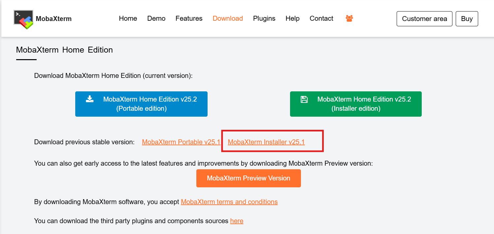
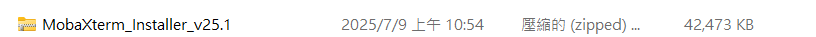
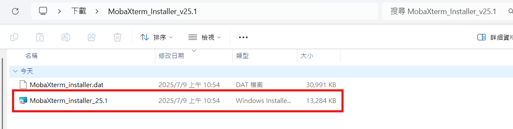
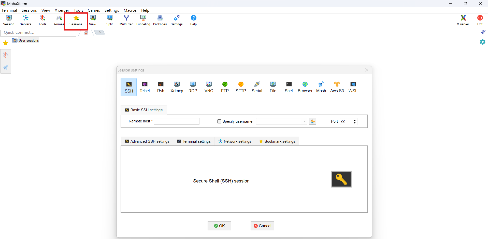

* Source
https://mobaxterm.mobatek.net/download-home-edition.html

* Step \

Download a stable version

Unzip the installer you download

Click the selection blew & start to install
 

Open MobaXterm & Click icon `sessions` and you can use ssh
